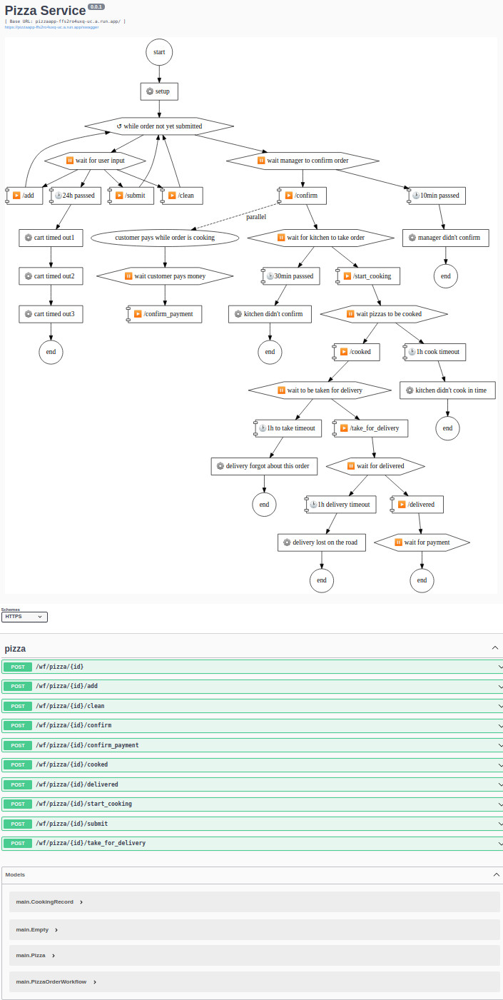

# pizzaapp
Example app using Gorchestrate to manage pizza ordering

It shows how you can brainstorm your workflows and create APIs to manage it on the fly.
This workflow definition was written in 5-10 minutes and simulates application for pizza ordering.

Using such approach you can create API's for workflow much faster and simpler.

## Example (autogenerated)
Deployed at https://pizzaapp-ffs2ro4uxq-uc.a.run.app/ui/

### Documentation (autogenerated)
https://petstore.swagger.io/?url=https://pizzaapp-ffs2ro4uxq-uc.a.run.app/swagger/pizza


### Definition
```go
func (wf *PizzaOrderWorkflow) Definition() async.Section {
	return S(
		Step("setup", func() error {
			wf.Status = "setup"
			return nil
		}),
		For("order not yet submitted", wf.Status != "submitted",
			Wait("for user input",
				gs.Timeout("cart timed out", 24*3600*time.Second, S(
					Return(), //stop workflow
				)),
				gasync.Event("Customer", "AddToCart", func(in Pizza) (PizzaOrderWorkflow, error) {
					wf.Cart = append(wf.Cart, in)
					return *wf, nil
				}),
				gasync.Event("Customer", "EmptyCart", func(in Empty) (PizzaOrderWorkflow, error) {
					wf.Cart = []Pizza{}
					return *wf, nil
				}),
				gasync.Event("Customer", "SubmitCart", func(in Empty) (PizzaOrderWorkflow, error) {
					wf.Status = "submitted"
					return *wf, nil
				}),
			),
		),

		Wait("manager to confirm order",
			gasync.Event("Manager", "ConfirmOrder", func(in ConfirmRecord) (PizzaOrderWorkflow, error) {
				wf.Status = "confirmed"
				wf.ManagerName = in.ManagerName
				wf.Amount = in.Amount
				return *wf, nil
			}),
		),

		Go("customer pays while order is cooking", S(
			Wait("customer pays money",
				gasync.Event("Manager", "ConfirmPayment", func(in PaymentRecord) (PizzaOrderWorkflow, error) {
					wf.PaidAmount = in.PaidAmount
					wf.Location = in.DeliveryAddress
					return *wf, nil
				}),
			),
		)),

		Wait("for kitchen to take order",
			gasync.Event("Cook", "StartCooking", func(in CookingRecord) (PizzaOrderWorkflow, error) {
				wf.Status = "cooking"
				wf.CookName = in.CookName
				return *wf, nil
			}),
		),

		Wait("pizzas to be cooked",
			gasync.Event("Cook", "Cooked", func(in Empty) (PizzaOrderWorkflow, error) {
				wf.Status = "cooked"
				return *wf, nil
			}),
		),

		Wait("to be taken for delivery",
			gasync.Event("Delivery", "TakeForDelivery", func(in Empty) (PizzaOrderWorkflow, error) {
				wf.Status = "delivering"
				return *wf, nil
			}),
		),
		Wait("for delivered",
			gasync.Event("Delivery", "Delivered", func(in Empty) (PizzaOrderWorkflow, error) {
				wf.Status = "delivered"
				return *wf, nil
			}),
		),
		WaitFor("payment", wf.PaidAmount > 0, func() {
			wf.Status = "completed"
		}),
	)
}
}
```

